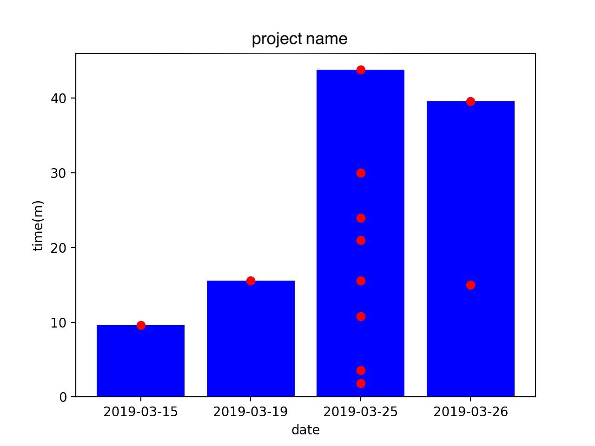

# toggl-to-graph
[toggl](https://toggl.com/)から取得したデータをグラフ化する
グラフ化したいプロジェクトと期間を指定できる
※[togglAPI](https://github.com/toggl/toggl_api_docs/blob/master/reports/detailed.md)の使用上、年をまたいだデータの取得が不可能

## 手順
1. `pip install python-dotenv　pandas matplotlib`
2. `python tggleToKosu.py 'プロジェクト名' '期間の開始点' '期間の終わり'`で実行
3. `Toggl-data.csv`というファイル名でグラフ用のCSVデータが書き出され、グラフが作成される

## サンプルグラフ

